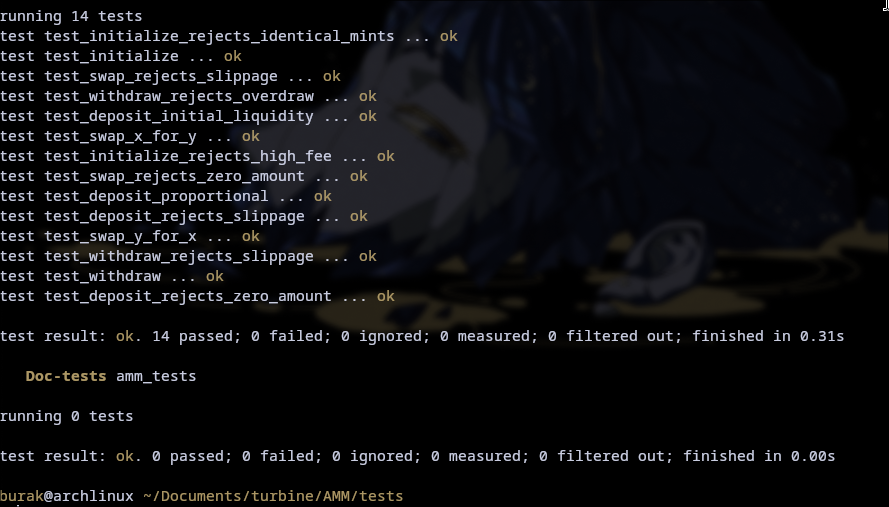

# Turbine Automated Market Maker


A constant-product (`x * y = k`) automated market maker, written with Anchor.
Two-token liquidity pools: provide liquidity, swap, and withdraw. Built for the
Turbine Solana Builders course.

## Layout

```
programs/amm/src/
  lib.rs            program entrypoints
  state.rs          Config account
  error.rs          error codes
  constants.rs      seeds, LP decimals, fee denominator
  instructions/     one file per instruction
tests/              LiteSVM tests (separate crate, see "Tests" below)
```

## Instructions

`initialize(seed, fee, authority)`
Creates a pool. Allocates the `Config` PDA, the LP mint, and the two vaults.
`fee` is in basis points (30 = 0.30%). `seed` lets one wallet open many pools.

`deposit(amount, max_x, max_y)`
Adds liquidity and mints `amount` LP tokens. `max_x` / `max_y` are slippage caps
on how much gets pulled in. The first deposit sets the starting price, so it
seeds the reserves with exactly `max_x` / `max_y`. Later deposits must match the
current ratio.

`swap(is_x, amount_in, min_out)`
Swaps one token for the other. `is_x = true` pays X and receives Y; `false` is
the reverse. The fee is taken on the input. The swap fails if the output is
below `min_out`.

`withdraw(amount, min_x, min_y)`
Burns `amount` LP tokens and returns the proportional share of both reserves.
Fails if either side comes back below `min_x` / `min_y`.

## Accounts

- `Config` PDA, seeds `["config", seed]`. Stores the two mints, the fee, the
  bumps, and a `locked` flag.
- LP mint PDA, seeds `["lp", config]`, with the config PDA as mint authority.
- Two vaults, the associated token accounts of the config PDA for each mint.

## Math

All intermediate arithmetic is done in `u128` with checked operations.

- Deposit rounds up: `x = ceil(amount * reserve_x / lp_supply)`, so rounding
  goes to the pool.
- Withdraw rounds down: `x = floor(amount * reserve_x / lp_supply)`, so the pool
  keeps the remainder.
- Swap: `out = reserve_out * in_after_fee / (reserve_in + in_after_fee)`, where
  `in_after_fee = amount_in * (10000 - fee) / 10000`.

## Build

```sh
anchor build --no-idl
```

`--no-idl` skips IDL generation, which fails on recent toolchains (an
`anchor-syn` 0.30.1 / proc-macro2 incompatibility). The tests don't need the IDL.

## Tests

The tests are a standalone crate under `tests/`, not a member of the program
workspace. The program pins the Solana 1.18 crate line (Anchor 0.30.1) while
LiteSVM needs Solana 2.x; keeping them in separate crates lets each resolve its
own dependencies. The tests load the compiled `target/deploy/amm.so` and build
instructions from raw bytes, so they never link the program crate.

```sh
cd tests && cargo test
```

There is one test per instruction plus the main failure paths (bad fee,
identical mints, zero amounts, and slippage on deposit/swap/withdraw).


